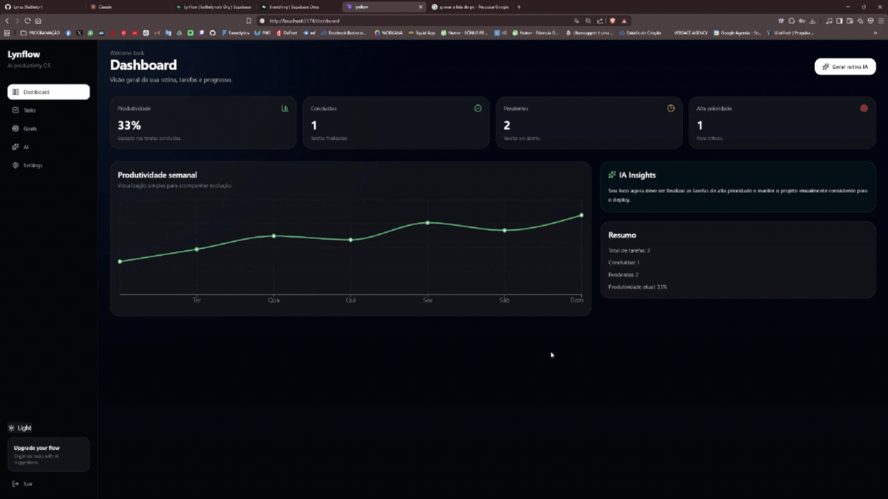
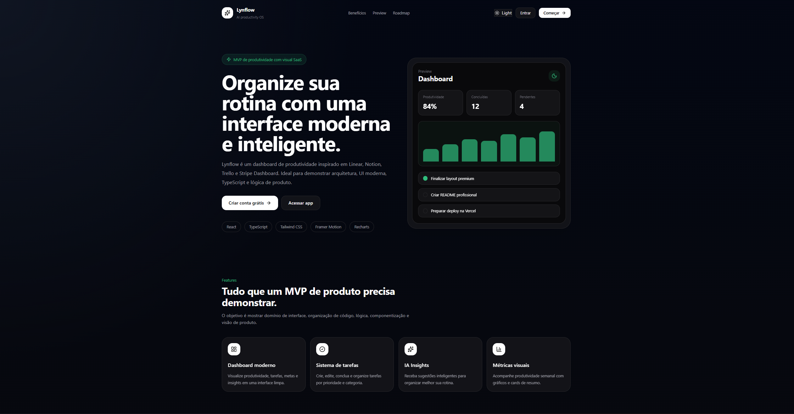
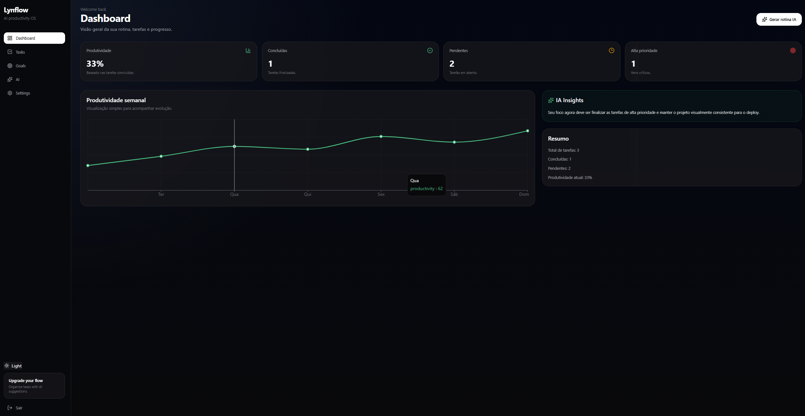
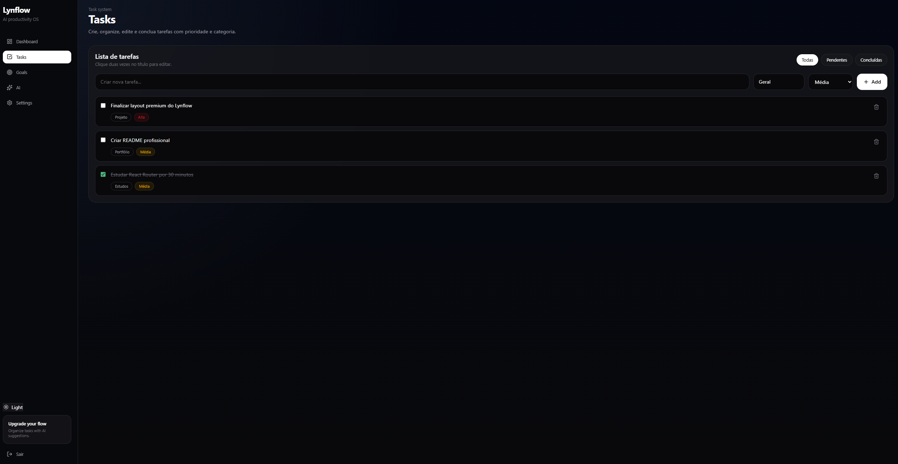
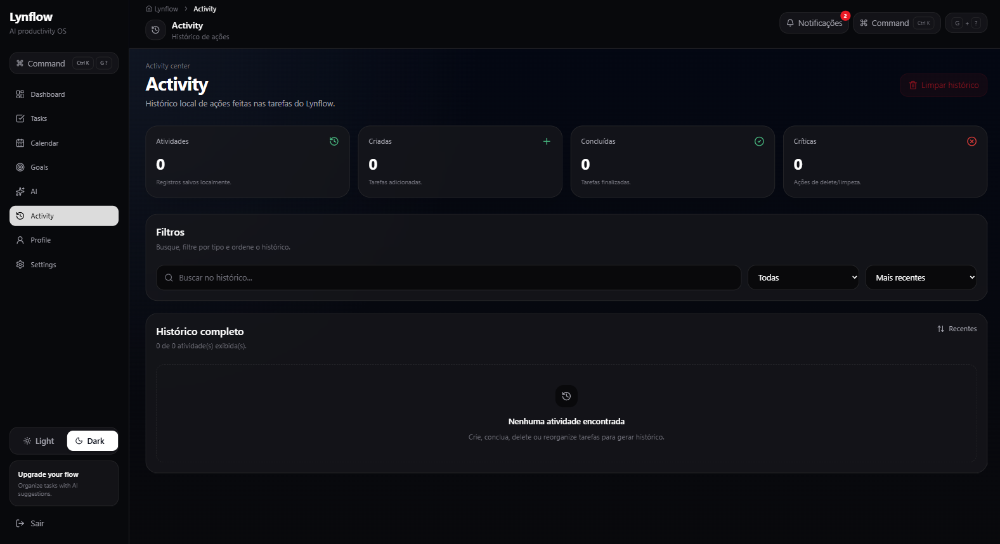

# Lynflow — AI Productivity Dashboard

<p align="center">
  
</p>

<p align="center">
  <strong>Dashboard de produtividade com tarefas, analytics, histórico, atalhos, onboarding e experiência SaaS.</strong>
</p>

<p align="center">
  <a href="#-sobre-o-projeto">Sobre</a> •
  <a href="#-demonstração">Demonstração</a> •
  <a href="#-funcionalidades">Funcionalidades</a> •
  <a href="#-tecnologias">Tecnologias</a> •
  <a href="#-como-rodar">Como rodar</a> •
  <a href="#-deploy">Deploy</a> •
  <a href="#-roadmap">Roadmap</a>
</p>

---

## 📌 Sobre o projeto

O **Lynflow** é um dashboard de produtividade desenvolvido com foco em experiência de usuário, organização pessoal e apresentação profissional para portfólio front-end.

O projeto simula um produto SaaS moderno, com autenticação local, rotas protegidas, gerenciamento de tarefas, métricas, gráficos, histórico de atividades, tema claro/escuro, onboarding, command palette e atalhos de teclado.

A proposta principal é demonstrar domínio em:

- React com TypeScript;
- componentização;
- estado global;
- persistência local;
- rotas protegidas;
- UI responsiva;
- experiência de produto;
- arquitetura front-end escalável;
- deploy com Vercel.

---

## 🚀 Demonstração

O Lynflow está disponível online pela Vercel:

```txt
lynflow.vercel.app
```

> Depois do deploy, substitua o link acima pelo link real gerado pela Vercel.

---

## 🖼️ Preview

### Preview principal

<p align="center">
  
</p>

### Landing Page

<p align="center">
  
</p>

### Dashboard

<p align="center">
  
</p>

### Tasks

<p align="center">
  
</p>

### Activity

<p align="center">
  
</p>

---

## ✨ Funcionalidades

### Autenticação local

- Cadastro de usuário.
- Login local.
- Logout.
- Rotas protegidas.
- Edição de perfil.
- Sessão salva no navegador.

### Dashboard

- Métricas de produtividade.
- Tarefas concluídas.
- Tarefas pendentes.
- Tarefas de alta prioridade.
- Gráfico de produtividade semanal.
- Gráfico por prioridade.
- Gráfico por categoria.
- Análise rápida automática.
- Feed de atividade recente.

### Tasks

- Criar tarefas.
- Editar tarefas.
- Deletar tarefas com confirmação.
- Marcar tarefas como concluídas.
- Reabrir tarefas.
- Categorizar tarefas.
- Definir prioridade.
- Buscar tarefas.
- Filtrar por status.
- Filtrar por prioridade.
- Filtrar por categoria.
- Ordenar por data, prioridade, título ou ordem manual.
- Reordenar com drag and drop.
- Persistência local com `localStorage`.

### Goals

- Visualização de metas do MVP.
- Progresso geral.
- Resumo técnico.
- Plano semanal.

### AI Insights

- Sugestões simuladas com base nas tarefas.
- Análise de produtividade.
- Priorização de ações.
- Recomendações para evolução do projeto.

### Activity

- Histórico completo de ações.
- Registro de tarefa criada.
- Registro de tarefa concluída.
- Registro de tarefa reaberta.
- Registro de tarefa deletada.
- Registro de reordenação.
- Registro de limpeza de tarefas.
- Registro de restauração da demo.
- Busca no histórico.
- Filtro por tipo de atividade.
- Ordenação por data.
- Limpeza do histórico com confirmação.

### Profile

- Dados da conta local.
- Avatar com iniciais.
- Edição de nome e e-mail.
- Métricas pessoais.
- Categorias usadas.
- Atalhos rápidos para Dashboard, Tasks e Goals.

### Settings

- Alternância entre tema claro e escuro.
- Controle de dados locais.
- Restaurar tarefas demo.
- Limpar tarefas.
- Limpar histórico.
- Reabrir onboarding.
- Checklist pré-deploy.
- Guia de deploy.
- Logout.

### Experiência de produto

- Tema dark/light.
- Skeleton loading.
- Toast notifications.
- Modal de confirmação.
- Onboarding inicial.
- Command Palette com `Ctrl + K`.
- Atalhos globais de navegação.
- Página 404 personalizada.
- Error Boundary.
- Layout responsivo.
- Menu mobile com More Menu.
- SEO básico.
- Favicon.
- Manifest.
- Preview social com `og-image`.

---

## ⌨️ Atalhos de teclado

| Atalho | Ação |
|---|---|
| `Ctrl + K` | Abrir Command Palette |
| `G` + `D` | Ir para Dashboard |
| `G` + `T` | Ir para Tasks |
| `G` + `G` | Ir para Goals |
| `G` + `I` | Ir para AI Insights |
| `G` + `A` | Ir para Activity |
| `G` + `P` | Ir para Profile |
| `G` + `S` | Ir para Settings |
| `N` | Ir para Tasks e focar no campo de nova tarefa |
| `Esc` | Fechar overlays/modais |

---

## 🛠️ Tecnologias

- React
- TypeScript
- Vite
- Tailwind CSS
- React Router DOM
- Framer Motion
- Recharts
- Lucide React
- DnD Kit
- LocalStorage
- Supabase opcional
- Vercel

---

## 📦 Bibliotecas principais

| Biblioteca | Uso |
|---|---|
| `react-router-dom` | Rotas e navegação |
| `framer-motion` | Animações e transições |
| `recharts` | Gráficos do Dashboard |
| `lucide-react` | Ícones |
| `@dnd-kit/core` | Drag and drop |
| `@dnd-kit/sortable` | Ordenação manual das tarefas |
| `@dnd-kit/utilities` | Transformações do drag and drop |
| `@supabase/supabase-js` | Backend, autenticação e persistência remota opcional |
| `tailwindcss` | Estilização |

---

## Backend e persistência

O Lynflow funciona em **modo local por padrão**. Quando as variáveis do Supabase não existem, autenticação, tarefas, perfil, configurações e histórico continuam usando `localStorage`, sem exigir backend.

Também é possível ativar o **modo Supabase** para autenticação real e persistência remota de tarefas e atividades. O app detecta automaticamente as variáveis abaixo:

```env
VITE_SUPABASE_URL=
VITE_SUPABASE_ANON_KEY=
```

Arquivos relacionados:

- `.env.example`: modelo das variáveis de ambiente.
- `supabase/schema.sql`: schema com tabelas, triggers, RLS e policies.

Para ativar:

1. Crie um projeto no Supabase.
2. Rode o SQL de `supabase/schema.sql` no SQL Editor.
3. Copie a Project URL e a anon key do projeto.
4. Crie um arquivo `.env.local` na raiz:

```env
VITE_SUPABASE_URL=sua_project_url
VITE_SUPABASE_ANON_KEY=sua_anon_key
```

5. Rode o projeto novamente:

```bash
npm run dev
```

O app não usa service role key no front-end. A segurança do banco fica protegida por RLS, e o fallback localStorage permanece disponível quando as variáveis não são configuradas.

---

## 🧱 Arquitetura

```txt
src/
├── assets/
├── components/
│   ├── auth/
│   ├── public/
│   ├── settings/
│   ├── skeletons/
│   ├── tasks/
│   └── ui/
├── hooks/
├── layouts/
├── pages/
│   └── auth/
├── routes/
├── services/
├── store/
├── types/
├── utils/
├── App.tsx
├── index.css
└── main.tsx
```

Arquivos importantes na raiz/pasta pública:

```txt
public/
├── favicon.svg
├── og-image.png
├── og-preview.html
├── preview.gif
├── robots.txt
└── site.webmanifest

vercel.json
README.md
index.html
package.json
vite.config.ts
```

---

## 🧩 Padrões usados

### Componentização

O projeto foi dividido em componentes reutilizáveis, como:

- `Button`
- `Input`
- `SectionCard`
- `MetricCard`
- `PageHeader`
- `ProgressBar`
- `ConfirmDialog`
- `ToastProvider`
- `CommandPalette`
- `OnboardingModal`
- `DeployChecklist`
- `DeployGuide`
- `ErrorBoundary`

### Estado global

As tarefas e atividades são centralizadas com Context API:

```txt
TasksProvider
↓
useTasks()
↓
Dashboard, Tasks, Goals, Insights, Activity, Profile, Settings
```

### Persistência local

O projeto usa `localStorage` para salvar:

- usuários;
- sessão;
- tarefas;
- atividades;
- tema;
- onboarding;
- checklist pré-deploy.

Quando `VITE_SUPABASE_URL` e `VITE_SUPABASE_ANON_KEY` são configuradas, o app usa Supabase para autenticação, tarefas e atividades, preservando a mesma UI e as mesmas rotas.

### Rotas protegidas

Páginas internas só podem ser acessadas com sessão local ativa.

```txt
ProtectedRoute
↓
AppLayout
↓
Página protegida
```

---

## 🔐 Autenticação local

O Lynflow possui autenticação simulada usando `localStorage`.

Esse modelo foi escolhido para manter o projeto simples, fácil de testar e focado em front-end.

Funcionalidades:

- cadastro;
- login;
- logout;
- sessão persistente;
- edição de perfil;
- proteção de rotas.

> Observação: por ser um projeto de portfólio front-end, as senhas ficam apenas em ambiente local de demonstração. Em produção real, o correto seria usar backend, Supabase, Firebase Auth, Auth.js ou outro serviço seguro.

---

## 📊 Analytics

O Dashboard calcula dados reais a partir das tarefas salvas:

- produtividade geral;
- tarefas concluídas;
- tarefas pendentes;
- tarefas de alta prioridade;
- produtividade por dia;
- tarefas por categoria;
- distribuição por prioridade;
- categoria dominante;
- status produtivo.

---

## 📱 Responsividade

O layout foi ajustado para:

- 320px;
- 375px;
- 430px;
- tablets;
- notebooks;
- desktops;
- telas grandes.

No mobile, a navegação usa menu inferior com:

```txt
Home | Tasks | Activity | Profile | More
```

As páginas secundárias ficam dentro do botão **More**:

```txt
Goals
AI Insights
Settings
Sair da conta
```

---

## 🔎 SEO e preview social

O projeto possui configuração básica de SEO no `index.html`:

- título;
- descrição;
- keywords;
- autor;
- Open Graph;
- Twitter Card;
- favicon;
- manifest;
- robots.

Arquivos relacionados:

```txt
index.html
public/favicon.svg
public/site.webmanifest
public/robots.txt
public/og-image.png
public/og-preview.html
```

A página `public/og-preview.html` foi criada para gerar uma arte de preview social em formato `1200x630`.

---

## 🧪 Como rodar

Clone o repositório:

```bash
git clone https://github.com/SEU-USUARIO/lynflow.git
```

Entre na pasta:

```bash
cd lynflow
```

Instale as dependências:

```bash
npm install
```

Rode o projeto:

```bash
npm run dev
```

Acesse:

```txt
http://localhost:5173
```

---

## 🏗️ Build

Para gerar a versão de produção:

```bash
npm run build
```

Para testar localmente o build:

```bash
npm run preview
```

Acesse:

```txt
http://localhost:4173
```

---

## 🚀 Deploy

O Lynflow está preparado para deploy na Vercel.

### Configuração da Vercel

O projeto possui o arquivo `vercel.json` na raiz:

```json
{
  "$schema": "https://openapi.vercel.sh/vercel.json",
  "framework": "vite",
  "buildCommand": "npm run build",
  "outputDirectory": "dist",
  "rewrites": [
    {
      "source": "/(.*)",
      "destination": "/index.html"
    }
  ]
}
```

Esse `rewrite` permite que rotas internas do React Router, como `/dashboard`, `/tasks` e `/settings`, funcionem corretamente no deploy.

### Configuração esperada na Vercel

| Campo | Valor |
|---|---|
| Framework | Vite |
| Install Command | `npm install` |
| Build Command | `npm run build` |
| Output Directory | `dist` |

### Fluxo recomendado

Teste o build:

```bash
npm run build
```

Faça o commit:

```bash
git add .
git commit -m "chore: prepare Lynflow for deploy"
git push
```

Depois:

1. Entrar na Vercel.
2. Clicar em **Add New Project**.
3. Importar o repositório do Lynflow.
4. Confirmar framework **Vite**.
5. Confirmar:
   - Build Command: `npm run build`
   - Output Directory: `dist`
6. Clicar em **Deploy**.
7. Testar a URL final.

### Rotas para testar após o deploy

```txt
/
 /login
 /register
 /dashboard
 /tasks
 /goals
 /insights
 /activity
 /profile
 /settings
 /qualquer-rota
```

A rota `/qualquer-rota` deve abrir a página 404 personalizada do Lynflow.

---

## 🖼️ Como gerar o preview social

O projeto possui uma página estática para gerar o preview:

```txt
public/og-preview.html
```

Para abrir:

```bash
npm run dev
```

Depois acesse:

```txt
http://localhost:5173/og-preview.html
```

Para gerar o print social:

1. Abra o DevTools.
2. Ative o modo responsivo.
3. Configure o tamanho:
   - largura: `1200`
   - altura: `630`
4. Recarregue a página.
5. Tire o screenshot.
6. Salve como:

```txt
public/og-image.png
```

Para o README, use o GIF principal em:

```txt
src/assets/preview.gif
```

---

## ✅ Checklist pré-deploy

- [ ] Build sem erros.
- [ ] Login testado.
- [ ] Cadastro testado.
- [ ] Dashboard testado.
- [ ] Tasks testado.
- [ ] Drag and drop testado.
- [ ] Activity testado.
- [ ] Profile testado.
- [ ] Settings testado.
- [ ] Página 404 testada.
- [ ] Responsividade revisada.
- [ ] Preview social gerado.
- [ ] GIF principal adicionado.
- [ ] Prints adicionados.
- [ ] README atualizado.
- [ ] Deploy publicado.
- [ ] Link adicionado ao GitHub.
- [ ] Link adicionado ao LinkedIn.

---

## 🧠 Decisões técnicas

### Por que `localStorage`?

Para manter o projeto simples, rápido e focado no front-end. O objetivo é demonstrar interface, experiência, arquitetura, estado global e persistência local.

### Por que Context API?

Porque o app possui múltiplas páginas consumindo os mesmos dados. Centralizar tarefas e atividades evita inconsistência entre telas.

### Por que DnD Kit?

Porque é uma solução moderna, flexível e adequada para drag and drop em React.

### Por que Recharts?

Porque permite criar gráficos simples e funcionais com boa integração em React.

### Por que Command Palette?

Porque melhora a experiência de produto e aproxima o projeto de aplicações SaaS modernas.

### Por que Error Boundary?

Para evitar tela branca em produção caso algum erro inesperado aconteça na renderização.

### Por que `vercel.json`?

Para configurar build, pasta de saída e suporte a rotas internas do React Router no deploy da Vercel.

---

## 🧭 Roadmap

### Concluído

- [x] Landing page
- [x] Login
- [x] Cadastro
- [x] Rotas protegidas
- [x] Dashboard
- [x] Tasks
- [x] Goals
- [x] AI Insights
- [x] Activity
- [x] Profile
- [x] Settings
- [x] Tema claro/escuro
- [x] Toast notifications
- [x] Modal de confirmação
- [x] Skeleton loading
- [x] Drag and drop
- [x] Histórico de atividades
- [x] Command Palette
- [x] Atalhos globais
- [x] Onboarding
- [x] Página 404
- [x] Error Boundary
- [x] Checklist pré-deploy
- [x] Guia de deploy
- [x] SEO básico
- [x] Manifest
- [x] Preview social
- [x] Configuração Vercel

### Melhorias futuras

- [ ] Integração real com Supabase.
- [ ] Autenticação real.
- [ ] Banco de dados remoto.
- [ ] Tarefas com data de vencimento.
- [ ] Kanban view.
- [ ] Calendário.
- [ ] Exportar dados.
- [ ] Integração com IA real.
- [ ] Testes automatizados.
- [ ] PWA.
- [ ] Notificações.
- [ ] Multiusuário.

---

## 🧾 Scripts

| Comando | Descrição |
|---|---|
| `npm run dev` | Roda o projeto em desenvolvimento |
| `npm run build` | Gera build de produção |
| `npm run preview` | Visualiza o build localmente |
| `npm run lint` | Roda lint, caso configurado |

---

## 👩‍💻 Desenvolvedora

Desenvolvido por **Kethelyn Carvalho**.

Projeto criado com foco em portfólio front-end, aprendizado prático e evolução profissional na área de desenvolvimento.

---

## 📄 Licença

Este projeto está sob licença MIT.

---

## ⭐ Status

```txt
Status: MVP portfolio-ready
Versão: 1.0.0
```

---

## 🧱 Commit recomendado

```bash
git add .
git commit -m "docs: update Lynflow README with deploy and preview instructions"
git push
```
